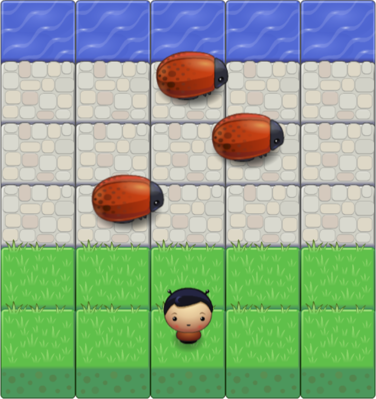

# Waroggā: A Cheap Clone of an Arcade Classic

This was my submission for an OOP JavaScript project that was part of Udacity's Front-End Web Developer Nanodegree. Making this, even as barebones as it is, was a lot of fun, and I look forward to adding more features, e.g. progressive difficulty and different playable characters, to it when I have more time.

Playing it is as easy as downloading the files and opening <i>index.html</i> with your browser, then using your arrow or WASD keys to guide our brave hero across the road while avoiding the ladybug-cockroach horrors.

Enjoying it, however, is more difficult, but I trust that you'll do your best.
