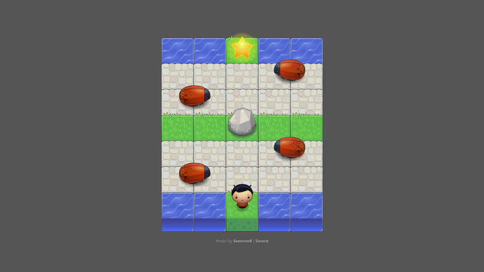

# Ladybugger: An Arcade Clone

[LIVE PREVIEW](https://seanvonb.github.io/arcade-game/)

This 2D arcade game is another project from 2019. More recently, I decided to fix some issues, expand the gameplay, and implement touch input handling for mobile. It was surprisingly fun, because working with an HTML Canvas engine is a pretty novel experience – just figuring out how to implement the touch controls was a whole adventure. Plus, doing some object-oriented programming was good practice. Give it a shot!

## Features

-   Play in real-time with constantly updating graphics on a 2D canvas
-   Input controls with WASD, arrow keys, mouse, or touch
-   Pause/unpause with ESC on desktop; no pause yet on mobile
-   Cycle through different player sprites with each life
-   Get smashed by speeding ladybugs

## Notes

Canvas elements don't have any accessible internal elements or features other than the pixels that compose their bitmap, so creating dynamic touch targets is a bit challenging. I solved this problem by using `Element.getBoundingClientRect()` to find the dimensions of the game's responsively resizing container, then I used those dimensions to normalize the click event's `clientX` and `clientY` values for the base scale of the canvas. Once normalized, the click event coordinates can then be used to hit moving touch targets that update whenever the canvas does. This technique might be useful again someday.

## Credits

-   This project was part of my [Front End Web Developer Nanodegree](https://www.udacity.com/course/front-end-web-developer-nanodegree--nd0011).
-   Art assets were provided by Udacity.

## License

Copyright © 2019-2022 Sean von Bayern  
Licensed under the [MIT License](LICENSE.md)
